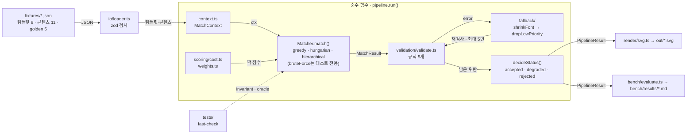
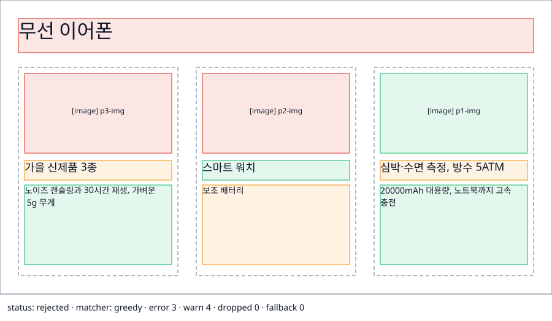
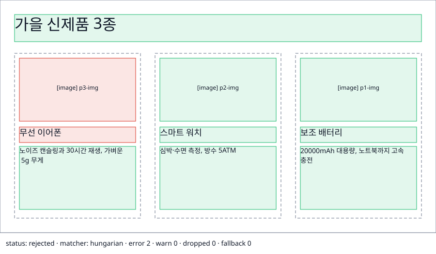
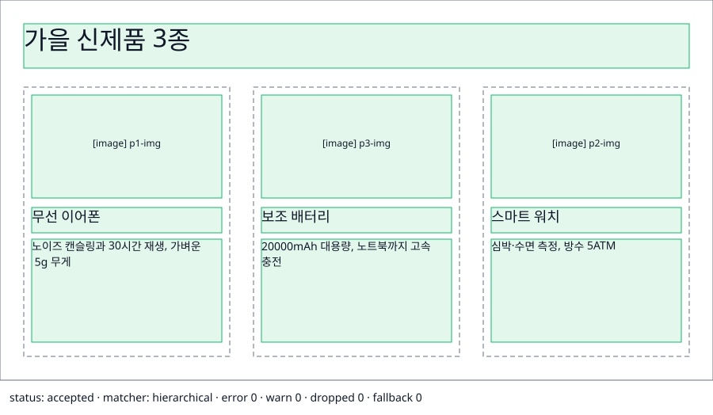

# SlotFit


구조가 다른 콘텐츠를 디자인 템플릿의 빈칸(slot)에 배치하고, 그 결과를 써도 되는지 판정하는 TypeScript 엔진.

```
pnpm install
pnpm test                                   # 단위·invariant·oracle·pipeline 테스트
pnpm bench                                  # 모든 템플릿 × 콘텐츠 × matcher → bench/results/*.md
pnpm bench:sweep                            # 가중치를 하나씩 절반·두 배로 바꿔 비교 → bench/results/sweep-*.md
pnpm render t04-product-cards-3 c05-product-launch hierarchical   # → out/*.svg
pnpm render:all                             # 모든 쌍의 SVG
```

> 이 문서는 사용자 결정과 Claude 제안을 구분해 적는다. 결정 근거는 모두 `spec.md` 부록 B(D-번호)에 있다.
> 이번 개발에서는 사용자가 🙋 결정(golden, 실패 분류, cost 가중치, severity, fallback, status 경계, 계층 매칭을 택한 이유)을 Claude에게 위임했다. 그래서 해당 항목은 「Claude 결정(사용자 위임)」으로 적혀 있고, 사용자가 다시 정하면 바뀐다.

## 구조



- 파일을 읽고 쓰는 곳은 `io/`, `scripts/`, `bench/`뿐이다. 가운데 상자 안은 모두 입력을 바꾸지 않는 순수 함수다.
- 조절하는 숫자(가중치·임계값)는 `src/scoring/weights.ts` 한 곳에만 있고, 각 숫자에 결정 ID(D-번호)가 달려 있다.

## 1. 문제 정의

AI가 포스터 문구 같은 콘텐츠를 만든 뒤에는 세 가지를 판단해야 한다.

- **matching**: 무엇을 어느 칸에 넣을지
- **validation**: 그 배치가 규칙을 지키는지
- **fallback**: 지키지 못하면 어떻게 대응하고, 언제 거절할지

SlotFit은 이 세 판단을 계산할 수 있는 구조로 만들고, 방식마다 실패를 수치로 비교한다.

## 2. 모델링

- **템플릿 = 트리.** frame 아래에 슬롯(text/image)이 있고, 함께 움직여야 하는 슬롯은 group(카드 한 장)으로 묶는다.
- **콘텐츠 = 목록.** 항목마다 kind, roleHint(없어도 됨), priority(1 = 버리면 안 됨)가 있고, 같은 카드에 들어가야 하는 항목끼리 groupId를 공유한다.
- **배치 = assignment problem.** 「항목 × 슬롯」 표에 짝마다 나쁨 점수(cost)를 적고, 합이 가장 작은 짝짓기를 찾는다. 항목이 남으면 「버림」, 슬롯이 남으면 「비움」에도 비용을 매긴다. dummy 행·열을 더해 표를 정사각으로 만드는 방식이다.
- **텍스트 크기는 근사한다(D-1).** 한글은 1.0em, 영문·숫자는 0.55em, 공백은 0.3em으로 보고, 줄 높이는 fontSize × 1.4로 잡는다. 실제 폰트와 다르다.

## 3. 실패 분류

greedy(슬롯을 DFS 순서로 돌며 같은 kind의 첫 항목을 넣는 방식) 결과를 보고 실패를 분류했다. 분류는 Claude가 했다(사용자 위임). 자세한 내용은 `spec.md` 부록 A에 있다.

| ID | 유형 | 종류 | 대표 fixture |
|---|---|---|---|
| F-1 | role 무시(제목 칸에 소제목) | cost | t01×c01 |
| F-2 | 길이 무시 넘침 | cost | t05×c04 |
| F-3 | 카드 섞임(다른 제품 사진 + 이름) | 구조 | t04×c05 |
| F-4 | 맞는 자리인데 넘침(긴 제목) | 사후 | t02×c03 |
| F-5 | 틀린 배치가 통과 | 사후 | t04×c05 |
| F-6 | priority와 role의 충돌 | 사후 | t08×c07 |
| F-7 | 카드가 제목 자리를 뺏음 | 구조 | t09×c09 |
| F-8 | 버림이 카드 찢어짐을 가림 | 사후 | t01×c01 |
| F-9 | 긴 본문이 소제목 칸으로 | cost | t05×c11 |

- cost: 점수로 풀 문제
- 구조: 제약으로 풀 문제
- 사후: validation·fallback으로 풀 문제

## 4. greedy → Hungarian → 계층 매칭

| 단계 | 해결한 것 | 남은 것 |
|---|---|---|
| **greedy** | 없음. 기준선 | F-1 ~ F-5 |
| **Hungarian** (Step 2) | F-1 대부분(t01×c01 golden 2/5 → 5/5), F-2 일부 | **F-3 카드 섞임**: t04×c05에서 card1 = p3 사진 + p1 이름·설명 |
| **계층 매칭** (Step 3) | F-3: groupSplit 6 → 0, t04×c05 golden 10/10 | **F-7**: 카드가 자리를 다 차지해 p1 제목을 버림 |

t04×c05(이미지 카드 3장)를 세 matcher로 그린 결과다.



greedy: golden 4/10, groupSplit 3. 제목 칸에 p1 소제목이 들어갔고 카드 세 장이 모두 섞였다.



hungarian: golden 8/10, groupSplit 2. 글은 role에 맞는 칸으로 갔지만 card1과 card3의 사진이 서로 바뀌었다.



hierarchical: golden 10/10, groupSplit 0. 카드마다 같은 제품의 사진·이름·설명이 들어갔다.

- 색: 빨강 = error, 주황 = warn, 초록 = 정상, 회색 점선 = 빈 칸
- 다시 만들기: `pnpm render t04-product-cards-3 c05-product-launch <matcher>` → `out/*.svg`

- **cost (D-13~D-16)**: 네 항목을 더한다.
  - role 불일치: 20
  - 넘침: 줄이면 들어가면 2, minFontSize에서도 넘치면 넘치는 줄마다 15
  - 너무 짧은 글: 최대 4
  - 입력 순서와의 위치 차이의 제곱: 최대 3

  버림 비용은 priority에 따라 1000/30/10, 비움 비용은 title 50부터 caption 5까지다. kind가 다른 짝에는 Infinity 대신 1,000,000을 쓴다. Hungarian이 값을 빼는 과정에서 Infinity−Infinity = NaN이 나오기 때문이다(D-15).
- **Hungarian**은 라이브러리 없이 O(N³)으로 직접 구현했다(`src/matchers/hungarian.ts`). 맞는지는 전수 탐색 oracle(`bruteForce`)과 fast-check 랜덤 입력의 totalCost를 비교해 확인한다(`tests/oracle.test.ts`).
- **계층 매칭**(`src/matchers/hierarchical.ts`)은 네 단계로 돈다.
  1. 카드끼리의 비용을 정한다. 콘텐츠 카드와 템플릿 카드의 비용은 「그 둘 안에서 Hungarian을 돌린 최소 비용」이다.
  2. 그 비용으로 카드끼리 Hungarian을 돌린다.
  3. 짝지어진 카드 안을 채운다.
  4. 남은 항목과 슬롯을 flat으로 짝짓는다.

  카드 밖으로 새는 항목이 없으므로 groupSplit은 구조적으로 0이다.
- **왜 최적이 아닌데도 계층 매칭인가 (D-19, Claude 결정 — 사용자 위임).**
  - 「카드가 찢어졌다」는 두 짝을 함께 봐야 판단할 수 있다. 그래서 짝별 cost의 합으로는 표현할 수 없다.
  - 계층 매칭은 다항 시간에 돌고, 단계마다 손으로 따라가며 설명할 수 있다.
  - 비최적인 경우(F-7)는 p1 유실로 드러나므로 validation이 거절로 잡는다.
  - 섞인 카드는 틀린 정보다. 그것을 내보내는 것보다 드물게 거절하는 편이 낫다고 봤다.

## 5. validation / fallback과 거절 기준 (Claude 결정 — 사용자 위임)

- **규칙과 severity (D-20)**

  | 규칙 | severity |
  |---|---|
  | overflow | error |
  | titleMissing | error |
  | priorityDropped (p1 유실) | error |
  | groupSplit | error |
  | roleMismatch | warn |

  내보내면 틀린 정보가 되는 위반은 error다. role이 어긋난 것은 보기엔 어색해도 정보는 맞으므로 warn이다.
- **fallback 순서 (D-21)**
  1. `shrinkFont`: 글자를 minFontSize까지 줄인다.
  2. `dropLowPriority`: 넘치는 항목을 p3 → p2 순으로 하나씩 버린다. p1은 버리지 않는다.

  validate와 fallback은 최대 5회 반복하고, 단계마다 `trace`에 남긴다.

  fixture 99쌍에서 `dropLowPriority`가 적용된 쌍은 greedy 11쌍, hungarian 0쌍, hierarchical 0쌍이다. cost가 넘침에 벌점을 주므로(D-14) 이 99쌍에서는 hungarian·hierarchical이 줄여도 넘칠 p2·p3 글을 배치 단계에서 넣지 않았다. 넘친 채 넣는 비용이 「버림 + 비움」보다 싼 입력에서는 두 matcher에서도 이 단계가 돈다(`tests/pipeline.test.ts`).
- **status (D-22)**
  - error가 남아 있으면 **rejected**
  - error는 없고 warn이 있거나 fallback이 한 번이라도 적용됐으면 **degraded**
  - 둘 다 아니면 **accepted**. 「손대지 않고 그대로 써도 됨」이라는 뜻이다.
- **거절이 맞는 fixture**
  - `c10-twelve-bodies`: p1 본문이 12개라 자리가 모자란다.
  - `c11-long-legal-notice`: 글자를 줄여도 넘치는 p1 고지문이다.

## 6. 수치

`pnpm bench` 결과다. 99쌍(템플릿 9 × 콘텐츠 11), golden 5쌍이고, fallback을 거친 뒤의 값이다. 원문은 `bench/results/`에 있다.

| matcher | goldenMatch | groupSplit | p1Dropped | status (acc/deg/rej) | ms |
|---|---|---|---|---|---|
| greedy | 0.43 | 9 | 77 | 9 / 56 / 34 | 0.015 |
| hungarian | 0.75 | 6 | 76 | 39 / 40 / 20 | 0.043 |
| hierarchical | **0.89** | **0** | 79 | **43 / 38 / 18** | 0.041 |

- ms는 쌍마다 워밍업 1회 뒤 21회 실행한 시간의 중앙값을 구하고, 그 값들을 평균한 것이다.

- p1Dropped는 대부분 c10(p1 본문 12개)에서 나온다. 이 콘텐츠는 어떤 matcher로도 다 넣을 수 없다.
- hierarchical의 rejected 18쌍은 셋으로 나뉜다.
  - c10 9쌍: p1 유실
  - c11 6쌍: 줄여도 넘침
  - t09 3쌍: F-7

golden 쌍별 결과(맞은 슬롯 / 전체):

| 쌍 | greedy | hungarian | hierarchical |
|---|---|---|---|
| t01×c01 카드 2장 | 2/5 | 5/5 | 5/5 |
| t02×c02 본문 과다 | 3/3 | 3/3 | 3/3 |
| t04×c05 이미지 카드 3장 | 4/10 | 8/10 | 10/10 |
| t05×c04 roleHint 없음 | 0/5 | 2/5 | 2/5 |
| t08×c07 사진·캡션 짝 | 3/5 | 3/5 | 5/5 |

### 가중치를 바꾸면

`pnpm bench:sweep`은 cost 가중치를 하나씩 절반·두 배로 바꾸고(나머지는 기본값) 99쌍을 hungarian·hierarchical로 다시 돌린다. 아래는 `bench/results/sweep-20261006-1013.md`의 값이고, 「달라진 쌍」은 기준과 최종 배치가 하나라도 다른 쌍 수를 두 배율 × 두 matcher로 합한 것이다.

- 달라진 쌍이 가장 많은 가중치: role 불일치 86, p3 버림 비용 46, body 비움 비용 39.
- 달라진 쌍이 0인 가중치: p1 버림 비용, title 비움 비용. 넘치는 줄당 비용과 image 비움 비용은 2씩이다.
- hierarchical의 groupSplit은 26개 변형 모두에서 0이고 goldenMatch는 0.89~0.93이다.
- hungarian은 goldenMatch 0.75~0.82, groupSplit 4~8이다.

## 7. 한계와 가정

- **텍스트 근사.** 줄 수는 「문단 너비 ÷ 칸 폭」을 올림해서 구한다(D-3). 단어 단위 줄바꿈과 실제 글꼴을 무시하므로 실제와 줄 수가 다를 수 있다.
- **계층 매칭은 전역 최적이 아니다.**
  - 짝 없는 카드의 비용을 「전부 버림」으로 비관적으로 잡는다.
  - 단계 사이에서 정보를 주고받지 않는다(D-18, F-7).
- **cost는 근사다.** 입력 순서는 「역전 쌍 수」 대신 위치 차이의 제곱으로 근사했다(D-16). 넘침도 줄 수로만 잰다(F-9).
- **roleHint가 없으면 자리를 잘 못 찾는다.** t05×c04 golden은 2/5다. 추정 규칙을 숨겨 두지 않은 결과다(D-8).
- **golden은 주관적이다.** 5쌍 모두 Claude가 「디자이너라면」 기준으로 썼다(D-10). 카드 순서 교환은 정답으로 센다(D-7, D-11).
- **fallback의 부작용.** 넘치는 항목을 버리면 groupSplit 위반까지 함께 사라질 수 있다(F-8).

## 8. 다음에 한다면

- 실제 폰트 측정(canvas 등)으로 근사를 대체한다.
- LLM이 만든 콘텐츠를 바로 연결하고, 거절되면 「줄여서 다시 써 달라」를 fallback 단계로 넣는다.
- 콘텐츠에 맞는 템플릿을 추천한다. 템플릿마다 totalCost와 status를 비교하면 된다.
- 「fallback이 groupSplit을 없애면 안 된다」 규칙을 넣고(F-8), 넘침을 비율로 매긴다(F-9).

## 9. AI 활용 방식

| 맡긴 것 (Claude) | 직접 판단한 것 (사용자) |
|---|---|
| 뼈대·타입·모든 모듈 구현, Hungarian·계층 매칭 구현과 단계별 주석 | Step 0 결정 4건: 이미지 포함(D-6), 카드 교환 허용(D-7), roleHint 없음은 미상(D-8), warn 1개부터 degraded(D-9) |
| fixture 설계, golden 초안, bench·oracle 테스트 | 「판단이 필요하면 알아서 정하고 기록하라」고 위임한 것. 그래서 아래는 Claude가 정했다 |
| 실패 분류, cost 가중치, severity, fallback 순서, status 경계, 계층 매칭 채택 이유(D-10, D-13~D-16, D-19~D-22) | 위 위임 결정들을 검토하고 바꾸는 일(`spec.md` 부록 B) |

- 세션 안의 일 나누기:
  - 계획·검토·글쓰기는 메인 세션이 했다.
  - 파일 수정과 테스트 실행은 하위 에이전트가 했다.
  - 메인 세션은 diff와 테스트 출력을 직접 다시 확인했다.
- 하위 에이전트 결과에서 메인 세션이 고친 것: 순서 항을 절댓값에서 제곱으로 바꿨다(D-16). t02×c02에서 순서가 뒤집히는 동점을 찾아낸 뒤의 일이다.
